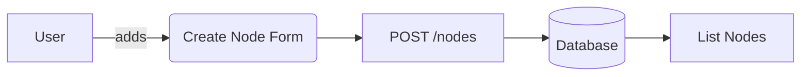

# Cyberpunk Laravel Starter

## Project Overview
Cyberpunk Laravel Starter is a Laravel 11 starter application running on PHP 8.3. It delivers a minimal cyberpunk themed dashboard complete with authentication, role based access and a CRUD interface for **Network Nodes**. The project is intended as a starting point for developers building futuristic web applications.

## Features
- User registration and login with email validation
- Editable profile dashboard
- Role-based authorization (admin and user)
- CRUD operations for Network Nodes
- Minimal cyberpunk UI using Blade templates and custom CSS

## Technology Stack
| Technology | Role |
|------------|------------------------------------------------------------|
| **PHP 8.3** | Core language running the application |
| **Laravel 11** | Backend framework providing MVC structure |
| **Blade templates** | View layer used to render the UI |
| **MySQL** | Example database (any database supported by Laravel) |
| **Composer** | Dependency management and autoloading |
| **Docker** | Optional containerization for running the stack |

## Architecture & Folder Structure
The application follows the traditional MVC structure.

```mermaid
graph TD
    A[Browser] --> B(routes/web.php)
    B --> C[Controllers]
    C --> D[Models]
    D --> E[(Database)]
    C --> F[Views (Blade)]
    F --> A
```

```
.
├── app
│   ├── Console
│   ├── Exceptions
│   ├── Http
│   │   ├── Controllers
│   │   └── Middleware
│   └── Models
├── bootstrap
├── config
├── database
│   └── migrations
├── public
│   └── css
├── resources
│   └── views
├── routes
└── scripts
```

## Endpoints (API Reference)
| Method | Route | Description |
|--------|-------|-------------|
| GET | `/` | Landing page |
| GET | `/login` | Show login form |
| POST | `/login` | Authenticate user |
| GET | `/register` | Show registration form |
| POST | `/register` | Handle user registration |
| POST | `/logout` | Logout current user |
| GET | `/dashboard` | Authenticated user dashboard |
| POST | `/dashboard` | Update profile details |
| GET | `/nodes` | List all nodes |
| GET | `/nodes/create` | Form to create a node |
| POST | `/nodes` | Persist a node |
| GET | `/nodes/{id}/edit` | Edit form |
| PUT | `/nodes/{id}` | Update a node |
| DELETE | `/nodes/{id}` | Delete a node |

## Setup & Installation
### Local Environment
1. Clone the repository
2. Install dependencies with Composer
3. Copy `.env.example` to `.env` and adjust database credentials
4. Generate the application key
5. Run migrations

```bash
git clone https://github.com/youruser/PHP-Laravel-Basic.git
cd PHP-Laravel-Basic
composer install
cp .env.example .env
php artisan key:generate
php artisan migrate
```

### Docker Compose
A simple `docker-compose.yml` could be used to run PHP, MySQL and the application.

```yaml
version: '3.8'
services:
  app:
    image: php:8.3-cli
    working_dir: /var/www
    volumes:
      - ./:/var/www
    command: php artisan serve --host=0.0.0.0 --port=8000
    ports:
      - "8000:8000"
    depends_on:
      - db
  db:
    image: mysql:8
    environment:
      MYSQL_DATABASE: cyberpunk
      MYSQL_ROOT_PASSWORD: secret
    ports:
      - "3306:3306"
```

Run the stack with:

```bash
docker-compose up -d
```

## Running the Project
Useful commands for development and deployment:

```bash
# start the local dev server
php artisan serve

# run migrations
php artisan migrate

# build for production
./scripts/deploy.sh
```

Stop the Docker stack:

```bash
docker-compose down
```

## Screenshots or Diagrams
Below is a simple diagram illustrating the Node CRUD flow.



## Contributing
1. Fork the repository and create a feature branch
2. Make your changes following PSR-12 coding style
3. Submit a pull request explaining your modifications

```bash
git checkout -b feature/my-feature
# commit changes
```

## License & Credits
This project is released under the MIT License. Feel free to use it as a starting point in your own applications.
