# 🌐⚡ Cyberpunk Network Control Panel ⚡🌐

## Project Overview
A fully-featured **Laravel 11** cyberpunk-themed web platform for network infrastructure management. This futuristic application combines advanced visual effects with real functionality, providing a complete dashboard for monitoring and managing network nodes with an immersive cyberpunk aesthetic.


## 🎮 Features

### 🔐 Authentication System
- **Futuristic login interface** with neon effects and glitch animations
- **User registration** with cyberpunk-themed forms
- **Session management** with visual connection status (CONNECTED/OFFLINE)
- **Secure logout** with "DISCONNECT" terminology

### 🌐 Network Node Management
- **Complete CRUD operations** for network infrastructure
- **Visual node cards** with neon borders and hover effects
- **Real-time status indicators** (ONLINE/ACTIVE simulation)
- **Node deployment interface** with futuristic terminology
- **Network matrix visualization** in grid layout

### 🎨 Cyberpunk Visual Effects
- **Animated grid background** with moving patterns
- **Floating particles** across the interface
- **Neon borders** with flickering animations
- **Glitch effects** on headers and titles
- **Gradient buttons** with hover transformations
- **Pulsing elements** and smooth transitions
- **Cyberpunk color scheme** (magenta, cyan, violet)

### 🎛️ Dashboard Features
- **Personal control center** with futuristic styling
- **Network overview** with status monitoring
- **Quick access** to all system functions
- **Responsive design** for all devices

## 🛠️ Technology Stack

| Technology | Role | Version |
|------------|------|----------|
| **PHP** | Core language running the application | 8.2+ |
| **Laravel** | Backend framework providing MVC structure | 11.45.1 |
| **Blade Templates** | View layer with cyberpunk UI components | Latest |
| **SQLite** | Lightweight database for development | Built-in |
| **Custom CSS** | Advanced cyberpunk styling and animations | Hand-crafted |
| **Composer** | Dependency management and autoloading | Latest |
| **Git** | Version control and collaboration | Latest |

## Architecture & Folder Structure
The application follows the traditional MVC structure.


```
.
├── app
│   ├── Console
│   ├── Exceptions
│   ├── Http
│   │   ├── Controllers
│   │   └── Middleware
│   └── Models
├── bootstrap
├── config
├── database
│   └── migrations
├── public
│   └── css
├── resources
│   └── views
├── routes
└── scripts
```

## 🛣️ System Routes (API Reference)

| Method | Route | Description | Features |
|--------|-------|-------------|----------|
| **GET** | `/` | 🏠 **Cyberpunk Landing Page** | Interactive cards, particle effects |
| **GET** | `/login` | 🔒 **System Access Portal** | Neon login form, glitch effects |
| **POST** | `/login` | 🔐 **Authentication Process** | Secure login validation |
| **GET** | `/register` | 📝 **Network Registration** | Futuristic signup interface |
| **POST** | `/register` | ✅ **User Creation** | Account validation and creation |
| **POST** | `/logout` | 🚪 **System Disconnect** | Secure session termination |
| **GET** | `/dashboard` | 🎛️ **Control Center** | Personal cyberpunk dashboard |
| **POST** | `/dashboard` | ⚙️ **Profile Management** | Update user settings |
| **GET** | `/nodes` | 🌐 **Network Matrix View** | Visual node grid with animations |
| **GET** | `/nodes/create` | 🚀 **Node Deployment** | Futuristic creation interface |
| **POST** | `/nodes` | 💾 **Deploy New Node** | Create network node |
| **GET** | `/nodes/{id}/edit` | 🔧 **Node Configuration** | Edit existing nodes |
| **PUT** | `/nodes/{id}` | 📡 **Update Node** | Modify node parameters |
| **DELETE** | `/nodes/{id}` | 🗑️ **Terminate Node** | Remove node from network |

## 🚀 Setup & Installation

### 🖥️ Local Environment Setup

1. **Clone the cyberpunk repository**
```bash
git clone https://github.com/yourusername/web-platform-cyberpunk-style.git
cd web-platform-cyberpunk-style
```

2. **Install dependencies**
```bash
composer install
```

3. **Configure environment**
```bash
cp .env.example .env
php artisan key:generate
```

4. **Setup database and create tables**
```bash
php artisan migrate
php artisan session:table
php artisan cache:table
php artisan migrate
```

5. **Launch the cyberpunk interface**
```bash
php artisan serve
```

6. **Access the system at** `http://127.0.0.1:8000`

### Docker Compose
A simple `docker-compose.yml` could be used to run PHP, MySQL and the application.

```yaml
version: '3.8'
services:
  app:
    image: php:8.3-cli
    working_dir: /var/www
    volumes:
      - ./:/var/www
    command: php artisan serve --host=0.0.0.0 --port=8000
    ports:
      - "8000:8000"
    depends_on:
      - db
  db:
    image: mysql:8
    environment:
      MYSQL_DATABASE: cyberpunk
      MYSQL_ROOT_PASSWORD: secret
    ports:
      - "3306:3306"
```

Run the stack with:

```bash
docker-compose up -d
```

## ⚡ Running the Cyberpunk Platform

Useful commands for development and deployment:

```bash
# 🚀 Launch the cyberpunk server
php artisan serve

# 🔄 Reset and migrate database
php artisan migrate:fresh

# 🧹 Clear all caches for fresh start
php artisan cache:clear
php artisan config:clear
php artisan view:clear

# 📊 Check system routes
php artisan route:list

# 🔧 Check migration status
php artisan migrate:status
```

Stop the Docker stack:

```bash
docker-compose down
```

## 📸 Visual Preview

### 🎨 Cyberpunk Interface Features
- **🌟 Neon-lit navigation** with connection status indicators
- **⚡ Animated particle background** for immersive experience
- **🎭 Glitch effects** on headers and important elements
- **🔮 Gradient buttons** with hover transformations
- **📱 Responsive design** that works on all devices

### 🔄 Network Node Flow

```mermaid
flowchart TD
    A[👤 Cyberpunk User] -->|🔐 System Access| B[🎛️ Control Panel]
    B -->|🚀 Deploy| C[📡 Create Node Interface]
    C -->|💾 Submit| D[(🗄️ Network Database)]
    D -->|📊 Display| E[🌐 Node Matrix Grid]
    E -->|⚙️ Configure| F[🔧 Edit Node]
    E -->|🗑️ Terminate| G[💥 Delete Node]
    F -->|🔄 Update| D
    G -->|🔥 Remove| D
```


## 🤝 Contributing to the Cyberpunk Network

1. **🍴 Fork the repository** and create a feature branch
2. **💻 Make your enhancements** following PSR-12 coding standards
3. **🎨 Maintain the cyberpunk aesthetic** in any UI changes
4. **🧪 Test your modifications** thoroughly
5. **📤 Submit a pull request** with detailed explanations

```bash
# 🌿 Create your cyberpunk feature branch
git checkout -b feature/cyberpunk-enhancement

# 💾 Commit your matrix changes
git add .
git commit -m "⚡ Add new cyberpunk feature"

# 🚀 Deploy to the network
git push origin feature/cyberpunk-enhancement
```

### 🎯 Contribution Guidelines
- **Maintain cyberpunk theme** consistency
- **Use futuristic terminology** in UI text
- **Add appropriate emoji** to enhance visual appeal
- **Include animations** for interactive elements
- **Test on multiple screen sizes**

## 📜 License & Credits

### 🛡️ MIT License
This cyberpunk network platform is released under the **MIT License**. Feel free to hack, modify, and deploy it in your own digital matrix.

### 🎨 Design Credits
- **Cyberpunk aesthetic** inspired by futuristic sci-fi interfaces
- **Neon color palette** optimized for digital immersion
- **Animation effects** designed for smooth user experience
- **Typography choices** selected for readability and style

### 🚀 Built With Passion
Crafted with ⚡ by developers who believe the future should look as cool as it functions.

---

**⚡ Enter the Matrix. Control the Network. Embrace the Future. ⚡**

🌐 `[SYSTEM READY - CONNECTION ESTABLISHED]` 🌐
